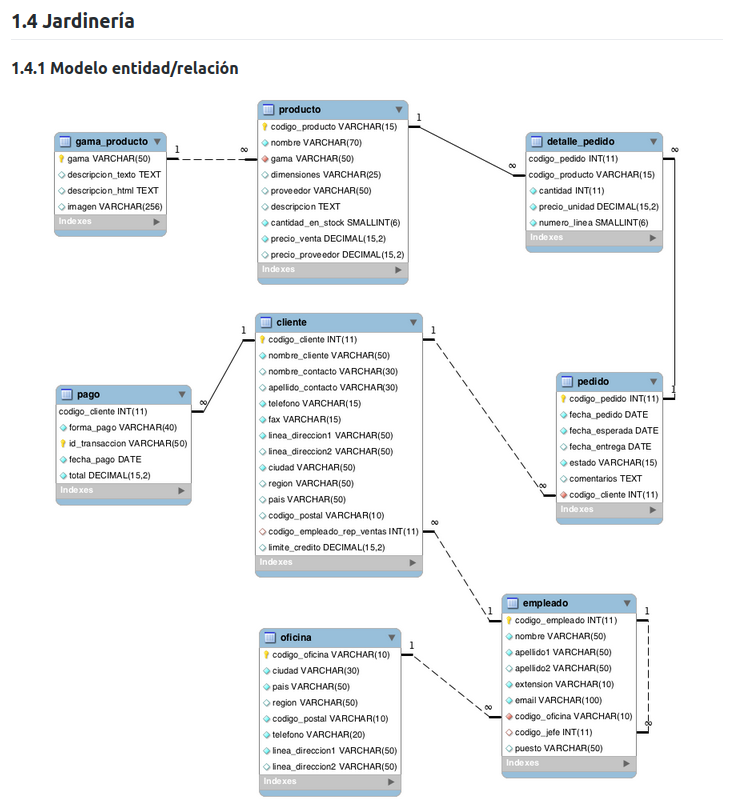

# JARDINERIA
A partir de una base de datos brindada se generaran unas consultas pertinentes, a continuacion se presenta la el modelo fisico junto con sus consultas. 

## Modelo Fisico



1. Obtén un listado con el nombre de cada cliente y el nombre y apellido de su representante de ventas.

```sql
    SELECT c.nombre_cliente AS Nombre_cliente, e.nombre AS Nombre_rep_ventas, e.apellido1 AS Apellido_rep_ventas FROM cliente c INNER JOIN empleado e ON c.codigo_empleado_rep_ventas = e.codigo_empleado;
```

```sql
    SELECT c.nombre_cliente AS Nombre_cliente,e.nombre AS Nombre_rep_ventas,e.apellido1 AS Apellido_rep_ventas FROM cliente c,empleado e WHERE c.codigo_empleado_rep_ventas = e.codigo_empleado;

```

2. Muestra el nombre de los clientes que hayan realizado pagos junto con el nombre de sus representantes de ventas.

```sql
    SELECT DISTINCT c.codigo_cliente AS COD_Cliente, c.nombre_cliente AS Nombre_cliente, CONCAT( e.nombre,' ',e.apellido1,' ',e.apellido2) AS Representante_ventas FROM cliente c INNER JOIN empleado e  ON c.codigo_empleado_rep_ventas = e.codigo_empleado INNER JOIN pago p ON c.codigo_cliente = p.codigo_cliente ;

```

3. Muestra el nombre de los clientes que no hayan realizado pagos junto con el nombre de sus representantes de ventas.

```sql
    SELECT c.codigo_cliente, c.nombre_cliente ,e.codigo_empleado, CONCAT(e.nombre,' ',e.apellido1,' ',e.apellido2 ) AS REPRESENTANTE_VENTAS FROM cliente c LEFT JOIN pago p ON c.codigo_cliente = p.codigo_cliente INNER JOIN empleado e ON c.codigo_empleado_rep_ventas = e.codigo_empleado WHERE p.codigo_cliente IS NULL;
```

4. Devuelve el nombre de los clientes que han hecho pagos y el nombre de sus representantes junto con la ciudad de la oficina a la que pertenece el representante.

```sql
     SELECT DISTINCT c.codigo_cliente , c.nombre_cliente AS Cliente , e.codigo_empleado, CONCAT (e.nombre,' ',e.apellido1) AS empleado , o.ciudad AS ciudad_Representante_Ventas  FROM cliente c INNER
JOIN empleado e ON c.codigo_empleado_rep_ventas = e.codigo_empleado INNER JOIN pago p ON c.codigo_cliente = p.codigo_cliente INNER JOIN oficina o ON e.codigo_oficina = o.codigo_oficina;
```

5. Devuelve el nombre de los clientes que no hayan hecho pagos y el nombre de sus representantes junto con la ciudad de la oficina a la que pertenece el representante.

```sql
    SELECT c.nombre_cliente , CONCAT (e.nombre,' ',e.apellido1,' ',e.apellido2)AS representante_ventas , o.ciudad FROM cliente c LEFT JOIN pago p ON c.codigo_cliente = p.codigo_cliente INNER JOIN empleado e ON c.codigo_empleado_rep_ventas = e.codigo_empleado INNER JOIN oficina o ON e.codigo_oficina = o.codigo_oficina WHERE p.codigo_cliente IS NULL;
```

6. Lista la dirección de las oficinas que tengan clientes en Fuenlabrada.

```sql
     SELECT DISTINCT o.linea_direccion1 AS OFICINA_DIRECCIÓN FROM oficina o INNER JOIN empleado e ON o.codigo_oficina = e.codigo_oficina INNER JOIN cliente c ON e.codigo_empleado = c.codigo_empleado_rep_ventas WHERE c.ciudad = 'Fuenlabrada';
```

7. Devuelve el nombre de los clientes y el nombre de sus representantes junto con la ciudad de la oficina a la que pertenece el representante.

```sql
    SELECT c.nombre_cliente , CONCAT (e.nombre,' ',e.apellido1,' ',e.apellido2)AS representante_ventas , o.ciudad AS Ciudad_Representante FROM cliente c INNER JOIN empleado e ON c.codigo_empleado_rep_ventas = e.codigo_empleado INNER JOIN oficina o ON e.codigo_oficina = o.codigo_oficina ;
```

8. Devuelve un listado con el nombre de los empleados junto con el nombre de sus jefes.

```sql
    SELECT e.nombre AS EMPLEADO, ej.nombre AS JEFE FROM empleado e LEFT JOIN empleado ej ON e.codigo_jefe = ej.codigo_empleado;
```

9. Devuelve un listado que muestre el nombre de cada empleados, el nombre de su jefe y el nombre del jefe de sus jefe.

```sql
    SELECT e.nombre AS EMPLEADO, ej.nombre AS JEFE ,ejj.nombre AS JEFE_DEL_JEFE FROM empleado e LEFT JOIN empleado ej ON e.codigo_jefe = ej.codigo_empleado LEFT JOIN empleado ejj ON ej.codigo_jefe = ejj.codigo_empleado;
```

10. Devuelve el nombre de los clientes a los que no se les ha entregado a tiempo un pedido.

```sql
    /* Agregando la entrega de fechas como NULL*/

    SELECT DISTINCT c.nombre_cliente FROM cliente c LEFT JOIN pedido p ON c.codigo_cliente = p.codigo_cliente WHERE p.fecha_entrega > p.fecha_esperada;
    
    /* Entrega de fechas como NULL  */
    SELECT DISTINCT c.nombre_cliente, p.fecha_esperada, p.fecha_entrega, p.estado, p.comentarios FROM cliente c LEFT JOIN pedido p ON c.codigo_cliente = p.codigo_cliente WHERE (p.fecha_entrega > p.fecha_esperada) OR ((p.fecha_entrega IS NULL) AND (p.estado = 'Entregado'));
    
    /* Opcion propuesta por el profesor  */
    SELECT DISTINCT c.nombre_cliente, p.fecha_esperada, p.fecha_entrega, p.estado, p.comentarios FROM cliente c LEFT JOIN pedido p ON c.codigo_cliente = p.codigo_cliente WHERE p.estado = 'Pendiente';
```

11. Devuelve un listado de las diferentes gamas de producto que ha comprado cada cliente.

```sql
    SELECT DISTINCT c.nombre_cliente , g.gama FROM gama_producto g INNER JOIN producto p ON g.gama = p.gama INNER JOIN detalle_pedido d ON p.codigo_producto = d.codigo_producto INNER JOIN pedido pd ON d.codigo_pedido = pd.codigo_pedido INNER JOIN cliente c ON pd.codigo_cliente = c.codigo_cliente;
```

## 1.4.6 Consultas multitabla (Composición externa)

**Resuelva todas las consultas utilizando las cláusulas LEFT JOIN, RIGHT JOIN, NATURAL LEFT JOIN y NATURAL RIGHT JOIN.**


1. Devuelve un listado que muestre solamente los clientes que no han realizado ningún pago.
 
 ```sql
SELECT c.codigo_cliente AS CODIGO, c.nombre_cliente AS CLIENTE FROM cliente c LEFT JOIN pago p ON c.codigo_cliente = p.codigo_cliente WHERE p.codigo_cliente IS NULL;

 ```
 
2. Devuelve un listado que muestre solamente los clientes que no han realizado ningún pedido.
 
 ```sql
SELECT c.nombre_cliente AS Clientes_no_pedido FROM cliente c LEFT JOIN pedido p ON c.codigo_cliente = p.codigo_cliente WHERE p.codigo_pedido IS NULL;  

 ```
 
3. Devuelve un listado que muestre los clientes que no han realizado ningún pago y los que no han realizado ningún pedido.
 
 ```sql
SELECT c.codigo_cliente AS CODIGO_cliente, c.nombre_cliente AS CLIENTE  from cliente c LEFT JOIN pago p ON  c.codigo_cliente = p.codigo_cliente LEFT JOIN pedido pd ON c.codigo_cliente = pd.codigo_cliente  WHERE p.codigo_cliente IS NULL AND pd.codigo_pedido IS NULL; 

 ```
 
4. Devuelve un listado que muestre solamente los empleados que no tienen una oficina asociada.
 
 ```sql
SELECT e.codigo_empleado AS CODIGO_EMPLEADO, e.nombre AS EMPLEADO FROM empleado e LEFT JOIN oficina o ON e.codigo_oficina= o.codigo_oficina  WHERE o.codigo_oficina IS NULL;

 ```
 
5. Devuelve un listado que muestre solamente los empleados que no tienen un cliente asociado.
 
 ```sql
SELECT e.nombre AS EMPLEADO FROM empleado e LEFT JOIN cliente c ON e.codigo_empleado = c.codigo_empleado_rep_ventas WHERE c.codigo_cliente IS NULL;

 ```
 
6. Devuelve un listado que muestre solamente los empleados que no tienen un cliente asociado junto con los datos de la oficina donde trabajan.
 
 ```sql
 SELECT e.codigo_empleado, e.nombre AS EMPLEADO, e.codigo_oficina, o.ciudad, o.pais FROM empleado e LEFT JOIN cliente c ON e.codigo_empleado = c.codigo_empleado_rep_ventas LEFT JOIN oficina o ON e.codigo_oficina = o.codigo_oficina WHERE c.codigo_cliente IS NULL;

 ```
 
7. Devuelve un listado que muestre los empleados que no tienen una oficina asociada y los que no tienen un cliente asociado.
 
 ```sql
 SELECT e.codigo_empleado, e.nombre AS EMPLEADO FROM empleado e LEFT JOIN oficina o ON e.codigo_oficina = o.codigo_oficina LEFT JOIN cliente c ON e.codigo_empleado = c.codigo_empleado_rep_ventas WHERE o.codigo_oficina IS NULL OR c.codigo_cliente IS NULL;

 ```
 
8. Devuelve un listado de los productos que nunca han aparecido en un pedido.
 
 ```sql
 SELECT p.codigo_producto, p.nombre AS producto FROM producto p LEFT JOIN detalle_pedido dp ON p.codigo_producto = dp.codigo_producto WHERE dp.codigo_producto IS NULL;

 ```
 
9. Devuelve un listado de los productos que nunca han aparecido en un pedido. El resultado debe mostrar el nombre, la descripción y la imagen del producto.
 
 ```sql
SELECT DISTINCT p.nombre AS Nombre_Producto, p.descripcion AS Descripcion FROM producto p LEFT JOIN detalle_pedido dp ON p.codigo_producto = dp.codigo_producto WHERE dp.codigo_producto IS NULL;

 ```
 
10. Devuelve las oficinas donde no trabajan ninguno de los empleados que hayan sido los representantes de ventas de algún cliente que haya realizado la compra de algún producto de la gama Frutales.
 
 ```sql
SELECT o.codigo_oficina, o.ciudad, o.pais FROM oficina o WHERE o.codigo_oficina NOT IN (SELECT DISTINCT e.codigo_oficina FROM empleado e WHERE e.codigo_empleado IN (SELECT DISTINCT c.codigo_empleado_rep_ventas FROM cliente c WHERE c.codigo_cliente IN (SELECT DISTINCT p.codigo_cliente FROM pedido p INNER JOIN detalle_pedido dp ON p.codigo_pedido = dp.codigo_pedido INNER JOIN producto prod ON dp.codigo_producto = prod.codigo_producto INNER JOIN gama_producto gp ON prod.gama = gp.gama WHERE gp.gama = 'Frutales')));

 ```
 
11. Devuelve un listado con los clientes que han realizado algún pedido pero no han realizado ningún pago.
 
 ```sql
 SELECT c.codigo_cliente, c.nombre_cliente FROM cliente c INNER JOIN pedido p ON c.codigo_cliente = p.codigo_cliente LEFT JOIN pago pa ON c.codigo_cliente = pa.codigo_cliente WHERE pa.codigo_cliente IS NULL;

 ```
 
12. Devuelve un listado con los datos de los empleados que no tienen clientes asociados y el nombre de su jefe asociado.
 
 ```sql
 SELECT e.codigo_empleado, e.nombre AS EMPLEADO, e.codigo_jefe, j.nombre AS JEFE FROM empleado e LEFT JOIN empleado j ON e.codigo_jefe = j.codigo_empleado LEFT JOIN cliente c ON e.codigo_empleado = c.codigo_empleado_rep_ventas WHERE c.codigo_cliente IS NULL;

 ```
 